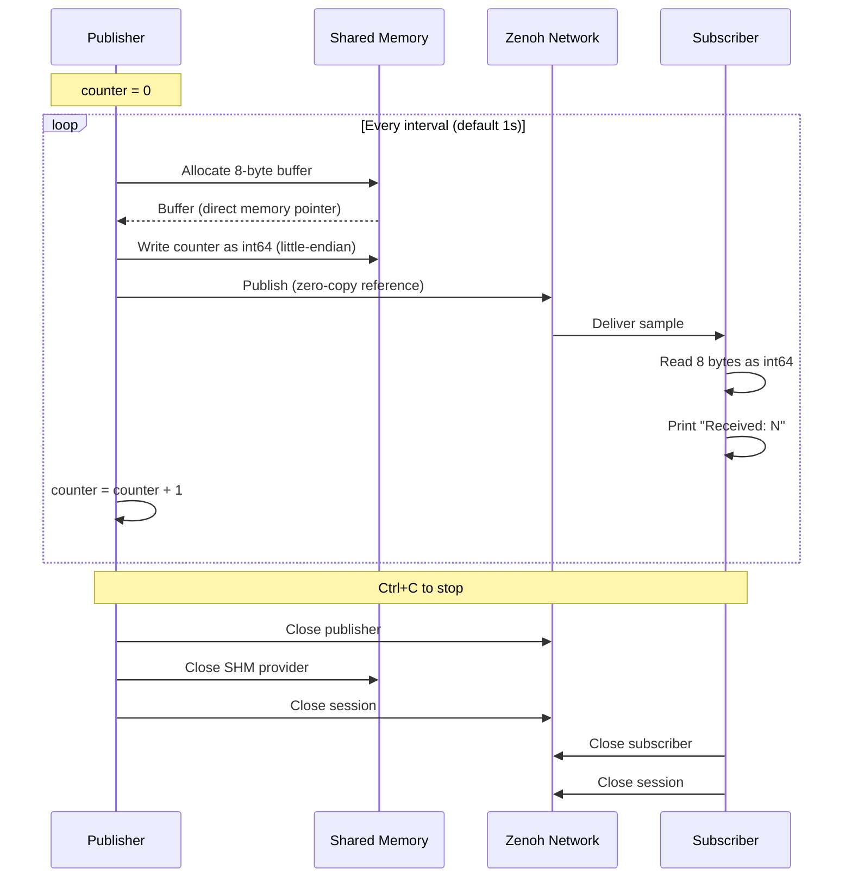
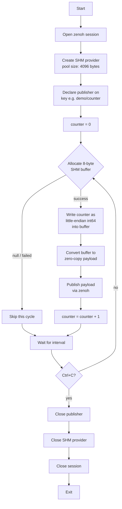

# User Manual

## How It Works

### Data Flow

The publisher and subscriber communicate through zenoh. The publisher uses
shared memory (SHM) for zero-copy performance — it writes the counter value
directly into a shared memory buffer and hands zenoh a reference instead of
copying the data.



### Publisher Loop



---

## Prerequisites

### 1. Install Dart dependencies

Native libraries (`libzenoh_dart.so`, `libzenohc.so`) are resolved automatically via the upstream package's build hooks. No manual library setup is needed.

```bash
fvm dart pub get
```

---

## Topology 1: Peer Direct

The subscriber listens on a TCP port and the publisher connects to it. No router needed.

### Terminal 1 -- Subscriber

```bash
fvm dart run bin/counter_sub.dart -l tcp/127.0.0.1:7447
```

### Terminal 2 -- Publisher

```bash
fvm dart run bin/counter_pub.dart -e tcp/127.0.0.1:7447
```

Expected output (subscriber):

```
Subscribing on "demo/counter"
Received: 0
Received: 1
Received: 2
...
```

Expected output (publisher):

```
Publishing on "demo/counter" every 1000ms
```

Press `Ctrl+C` in each terminal to stop.

---

## Topology 2: Peer Multicast

Both programs use default config with multicast scouting. No flags needed, no router needed. Both programs must be on the same network segment.

### Terminal 1 -- Subscriber

```bash
fvm dart run bin/counter_sub.dart
```

### Terminal 2 -- Publisher

```bash
fvm dart run bin/counter_pub.dart
```

---

## Topology 3: Via Router

Both programs connect to a zenoh router (`zenohd`). The router must be running first.

### Locate zenohd

If `zenohd` is not on your PATH, locate it in your zenoh build:

```bash
# Example location (adjust to your setup)
export ZENOHD=/path/to/zenoh/target/release/zenohd
```

### Terminal 1 -- Router

```bash
zenohd
```

Expected output:

```
zenohd v1.7.2 built with rustc ...
Using ZID: ...
Zenoh can be reached at: tcp/192.168.x.x:7447
```

Wait until the router prints its reachable endpoints before starting the subscriber.

### Terminal 2 -- Subscriber

```bash
fvm dart run bin/counter_sub.dart -e tcp/127.0.0.1:7447
```

Expected output:

```
Subscribing on "demo/counter"
Received: 0
Received: 1
...
```

### Terminal 3 -- Publisher

```bash
fvm dart run bin/counter_pub.dart -e tcp/127.0.0.1:7447
```

Expected output:

```
Publishing on "demo/counter" every 1000ms
```

Press `Ctrl+C` in each terminal to stop (publisher, subscriber, then router).

---

## CLI Flags

### Common flags (both programs)

| Flag | Description | Default |
|------|-------------|---------|
| `-k, --key <KEYEXPR>` | Key expression | `demo/counter` |
| `-e, --connect <ENDPOINT>` | Connect to endpoint (repeatable) | none |
| `-l, --listen <ENDPOINT>` | Listen on endpoint (repeatable) | none |

### Publisher-only flags

| Flag | Description | Default |
|------|-------------|---------|
| `-i, --interval <MS>` | Publish interval in milliseconds | `1000` |

---

## Examples

### Custom key expression

```bash
# Terminal 1
fvm dart run bin/counter_sub.dart -k my/sensor/temp -l tcp/127.0.0.1:7450

# Terminal 2
fvm dart run bin/counter_pub.dart -k my/sensor/temp -e tcp/127.0.0.1:7450
```

### Fast publish (200ms interval)

```bash
# Terminal 1
fvm dart run bin/counter_sub.dart -l tcp/127.0.0.1:7450

# Terminal 2
fvm dart run bin/counter_pub.dart -i 200 -e tcp/127.0.0.1:7450
```

### Multiple connect endpoints

```bash
fvm dart run bin/counter_pub.dart -e tcp/host1:7447 -e tcp/host2:7447
```

---

## Running Tests

```bash
fvm dart test
```

## Static Analysis

```bash
fvm dart analyze
```
